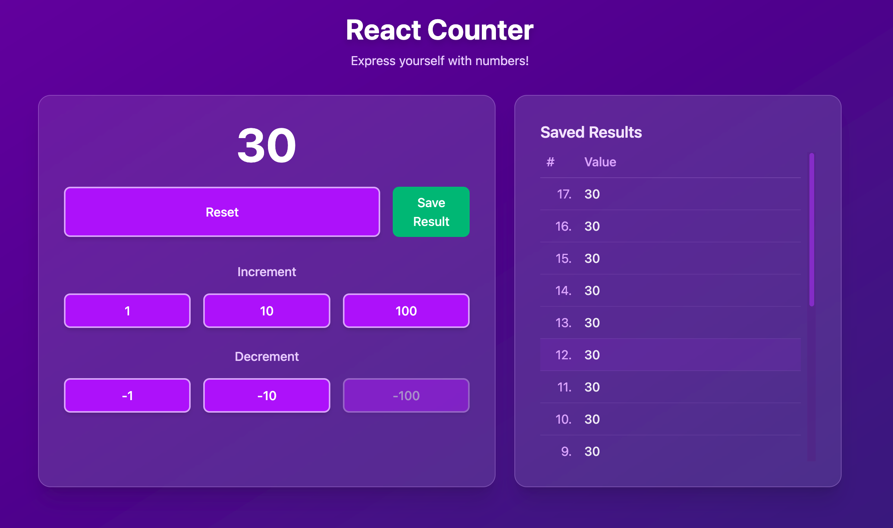

# Update README with Saved Results Feature

Here's an updated README that includes information about the new save results feature:

# React Counter Application

A simple yet elegant counter application built with React, TypeScript, and Tailwind CSS.

## Features

- Increment and decrement by different values (1, 10, 100)
- Cannot go below zero
- Reset functionality
- Save results to a history list
- View saved counter values in a table format
- Responsive design with purple inspired theme

## Screenshot


*Screenshot of the React Counter application*

## Technologies Used

- React 18
- TypeScript
- Vite
- Tailwind CSS

## Getting Started

1. Clone this repository
2. Install dependencies:

```sh
npm install
```

3. Start the development server:

```sh
npm run dev
```

## How to Use

- Use the increment/decrement buttons to adjust the counter value
- Click "Save Result" to add the current count to your saved results list
- View your saved results in the panel to the right (or below on mobile devices)
- Use the "Reset" button to clear both the counter and saved results

## Build for Production

```sh
npm run build
```

## License

This project is licensed under the ISC License - see the [LICENSE](./LICENSE) file for details.
